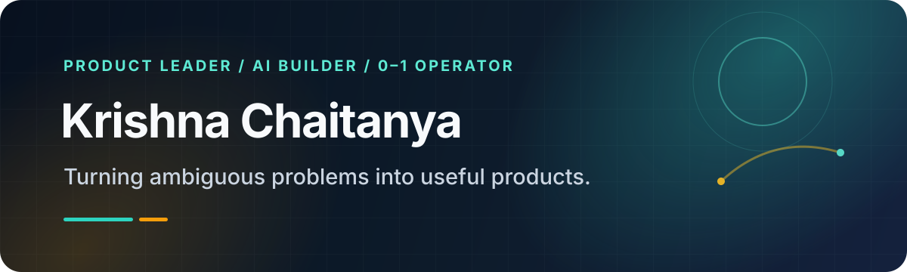

  

  <a href="https://chaitanya.lol"><strong>Portfolio</strong></a> ·
  <a href="https://www.linkedin.com/in/chaitanya-athukuri/"><strong>LinkedIn</strong></a> ·
  <a href="https://x.com/chaitanyabuilds"><strong>X</strong></a>

## Builder by habit. Product manager by craft.

I build AI-driven products for teams moving through ambiguity: tools that make decisions clearer, workflows simpler, and shipping safer.

My product education started the expensive way. I co-founded a short-video app, took it to 10,000+ downloads in one week, then shut it down ten days later. That experience taught me what no framework could: find the real constraint, ship the smallest useful thing, and learn before certainty becomes expensive.

Today, I bring that lesson to 0–1 product work and hands-on builds across AI agents, developer tools, analytics, and consumer experiments.

## Selected builds

| Project | What it does | Explore |
|---|---|---|
| **Fumble Machine** | Turns past purchases into shareable “what if I invested instead?” receipts using real market data. | [Live product](https://fumble-machine.vercel.app) · [Source](https://github.com/MrForward/Fumble-Machine) |
| **TokenBurn** | A privacy-first browser extension that estimates AI token use locally and turns it into a visual activity trail. | [Source](https://github.com/MrForward/tokenburn) |
| **ProdReady** | Checks AI-generated web apps for security leaks, SEO gaps, and production-readiness issues before launch. | [Live product](https://prod-ready-navy.vercel.app) · [Source](https://github.com/MrForward/ProdReady) |
| **Agentic Product Manager** *(WIP)* | Planned agent workflow for stress-testing product ideas, checking market signals, and producing an opinionated build sequence. | [Source](https://github.com/MrForward/Agentic-Product-Manager) |
| **Chaitanya.lol** | My product work, experiments, and lessons from building across B2B, B2C, and AI. | [Read the story](https://chaitanya.lol) |

## How I build

1. **Find the real problem** — talk to users, inspect behavior, and separate signal from requests.
2. **Reduce the bet** — turn uncertainty into the smallest test that can change a decision.
3. **Ship the loop** — build, measure, learn, and keep the feedback cycle short.
4. **Make it reusable** — turn hard-won learning into systems, tools, and clearer defaults.

**Current focus:** AI product strategy, agent workflows, visibility measurement, and trustworthy shipping.

**Tools I reach for:** TypeScript, Python, Next.js, SQL, product analytics, and whichever model best fits the job.

---

If you are building something useful at the edge of product and AI, [say hello](https://chaitanya.lol/contact).
